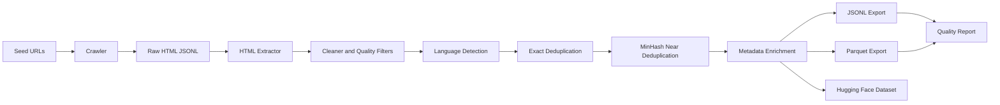

# LLM Dataset Curation Pipeline

A portfolio-grade data curation project that converts raw public web pages into clean, deduplicated, metadata-rich datasets for LLM training workflows.

Raw web data is noisy and not directly suitable for model training. It often contains navigation text, duplicate pages, empty pages, boilerplate, unsupported languages, broken formatting, and missing provenance. This project demonstrates how to build a reproducible curation pipeline that turns that raw material into usable `JSONL`, `Parquet`, and Hugging Face dataset artifacts.

## Interview Pitch

> I built a reproducible dataset curation pipeline that converts raw public web pages into clean, deduplicated, metadata-rich JSONL and Parquet datasets suitable for LLM training workflows.

## What This Demonstrates

```text
web ingestion
HTML parsing
text cleaning
language detection
metadata/provenance
deduplication
dataset validation
JSONL/Parquet export
Hugging Face Datasets workflow
quality reporting
```

## Architecture



## Setup

Use Python `>=3.11,<3.15`.

```bash
cd llm-dataset-curation-pipeline
python3 -m venv .venv
source .venv/bin/activate
pip install -e ".[dev]"
```

For the dashboard UI, install the optional frontend dependency:

```bash
pip install -e ".[dev,ui]"
```

## Run The Full Pipeline

```bash
curate-web all --config configs/seeds.example.yml
```

This produces:

```text
data/raw/pages.jsonl
data/raw/crawl_stats.json
data/processed/curated_dataset.jsonl
data/processed/curated_dataset.parquet
data/processed/rejected_records.jsonl
data/processed/dedup_report.json
data/huggingface/curated_dataset/
reports/dataset_quality.md
reports/dataset_quality.json
```

## Run Individual Stages

```bash
curate-web crawl --config configs/seeds.example.yml
curate-web curate --input data/raw/pages.jsonl --config configs/seeds.example.yml
curate-web report --input data/processed/curated_dataset.jsonl
```

## Run The Frontend

```bash
streamlit run app/streamlit_app.py
```

The dashboard lets you:

- edit seed URLs, domains, crawl depth, page limits, language filters, and quality thresholds
- run the full curation pipeline
- inspect fetched, curated, rejected, and duplicate counts
- preview curated records
- download JSONL, Parquet, and report artifacts

## Configuration

The default demo uses public Wikipedia pages:

```yaml
project_name: llm_dataset_curation_demo
allowed_domains:
  - en.wikipedia.org
seed_urls:
  - https://en.wikipedia.org/wiki/Large_language_model
  - https://en.wikipedia.org/wiki/Machine_learning
  - https://en.wikipedia.org/wiki/Natural_language_processing
max_pages: 30
max_depth: 1
request_delay_seconds: 1
language_allowlist:
  - en
license: CC BY-SA
source_type: public_web
```

## Output Schema

Each curated record has this structure:

```json
{
  "id": "sha256 stable id",
  "source_url": "https://...",
  "domain": "en.wikipedia.org",
  "title": "Large language model",
  "text": "clean extracted text",
  "language": "en",
  "language_confidence": 0.99,
  "license": "CC BY-SA",
  "source_type": "public_web",
  "fetched_at": "ISO timestamp",
  "processed_at": "ISO timestamp",
  "content_hash": "sha256 hash",
  "word_count": 1234,
  "char_count": 7890,
  "quality_flags": [],
  "pipeline_version": "0.1.0"
}
```

## Quality Checks

The pipeline removes or flags records using:

- empty text detection
- minimum word and character thresholds
- low alphabetic ratio checks
- excessive punctuation checks
- repeated-line checks
- language allowlist filtering
- exact duplicate detection with SHA-256 hashes
- near-duplicate detection with MinHash and LSH

## Dataset Quality Report

The report includes:

- total URLs discovered
- pages fetched successfully
- pages dropped by reason
- rows before and after deduplication
- language distribution
- domain distribution
- word and character statistics
- duplicate examples
- final schema
- sample curated record

## Tests

Tests use local HTML fixtures and do not require internet access.

```bash
pytest
```

The smoke test runs the full pipeline against local `file://` pages and verifies the expected dataset and report artifacts.
